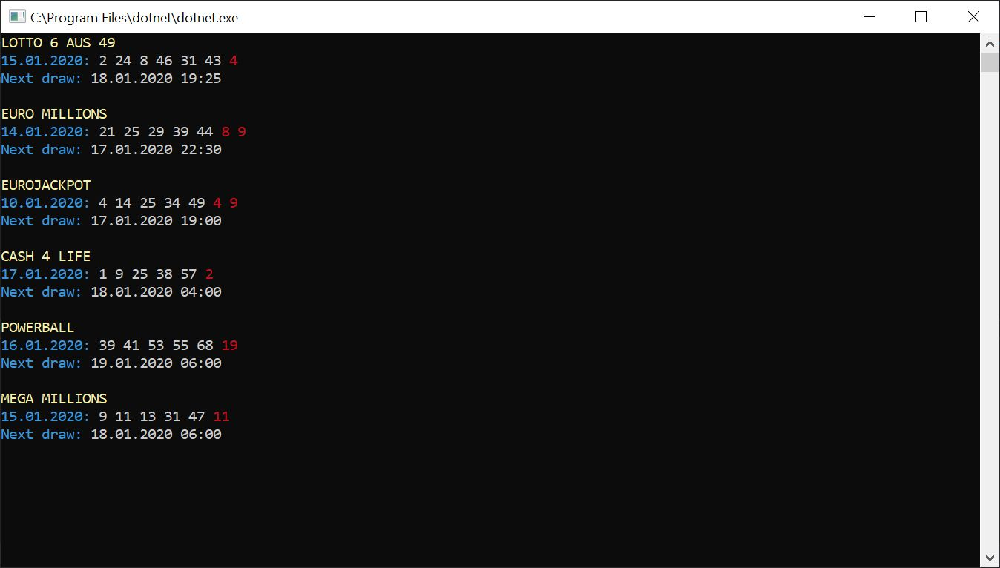

# lotto

A .NET Standard library for polling the current lottery numbers.

## Introduction

My wife and I play the lottery from time to time. But I always forget where to look for the results when the big day of the draw finally arrives. So I end up visiting random lottery websites and get burried with ads, cookie-, and newsletter-popups. That's why I decided to create my own little lottery library that is able to poll the current draws - because I will never forget how to open the bash ;-)

## Getting Started

* Download the [latest **lotto** release](https://github.com/selmaohneh/lotto/releases) or clone the repository and build the project yourself!
* If you want to poll the lottery numbers for your own project add a reference to the ``lotto.core.dll``. Retrieve the current draws of all supported lotteries via ``IEnumerable<Draw> draws = Lotto.GetDraws();``.
* If you just want to see the current lottery numbers have a look at ``lotto.console.dll``. This .NET Core console application utilizes ``lotto.core.dll`` to poll the latest draws and plots them to your console/bash (as shown [in the sample image](console.JPG)). Try it out via ``dotnet lotto.console.dll``! 

## Where does **lotto** get the data from?

Unfortunately I was not able to find a good public API for lottery numbers. That's why I went for a web scraping approach. **lotto** loads the html content of [dielottozahlende.net](https://www.dielottozahlende.net) and extracts all the data via [XPath expressions](https://en.wikipedia.org/wiki/XPath). Of course this approach is not very robust since it depends on the website's html classes. These XPath expressions will need to be updated if [dielottozahlende.net](https://www.dielottozahlende.net) decides to do some wild refactorings. Let's hope that this won't happen regularly or that there will be a better approach until then. :-)

## Contributing

* You enhanced or refactored something? Feel free to [create Pull Requests](https://github.com/selmaohneh/lotto/pulls)! 
* You found a bug or have an idea for a new feature? Please [file an issue](https://github.com/selmaohneh/lotto/issues).
* [Kaffee? :-)](https://www.buymeacoffee.com/SaMAsU1N6)
